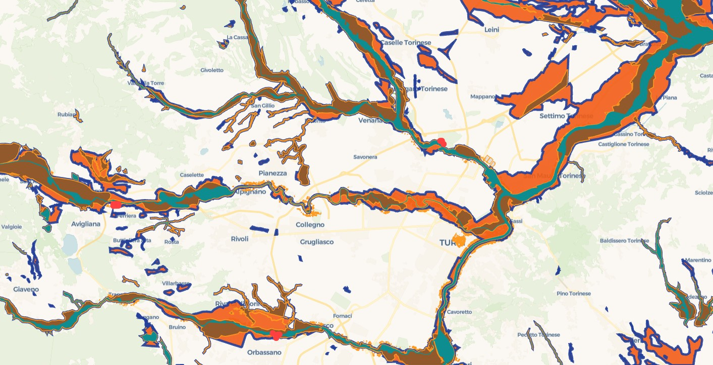
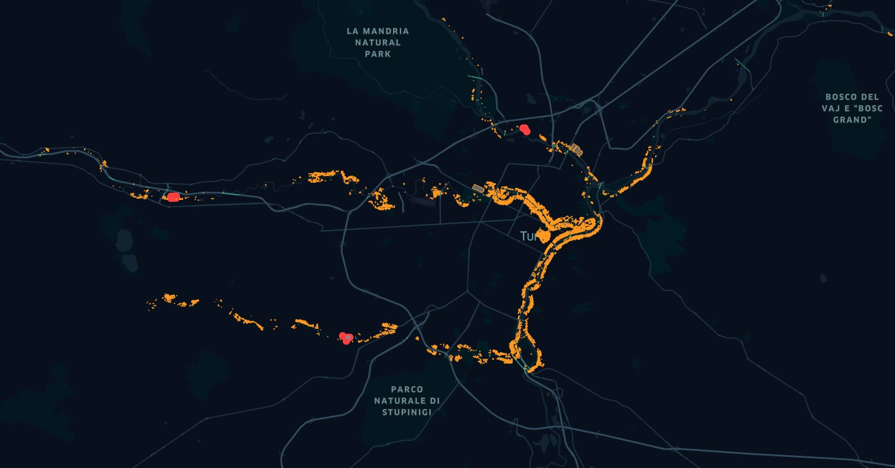

# Turin Hydrogeological Risk Assessment: An InSAR & Open-Data Spatial Triage Tool

An automated geospatial data pipeline designed to detect, classify, and visualize active ground deformation along the Po River corridor in Turin, Italy.

This project fuses millimeter-precision European Ground Motion Service (EGMS) radar data with OpenStreetMap (OSM) civil infrastructure and official Italian environmental hazard maps (ISPRA PAI). By applying spatial statistics and proximity buffers, it operates as an early-warning dashboard to identify structural vulnerabilities before critical failures occur.



## 📌 Project Overview

Traditional hydrogeological risk maps are often static, relying on historical flood or landslide data. This project introduces a dynamic approach: utilizing satellite-based Interferometric Synthetic Aperture Radar (InSAR) to measure actual ground movement in real-time. By filtering millions of data points and isolating significant deformation clusters, this tool bridges the gap between raw satellite data and actionable urban asset management.

## ⚙️ Methodology & Processing Pipeline

The analysis is driven by a series of modular Python scripts located in the `scripts/` directory, utilizing GeoPandas, PySAL, and OSMnx. The pipeline is designed to handle massive datasets efficiently:

**1. Spatial Triage & Data Ingestion** (`spatial_triage.py`)
- Processes massive EGMS L3 CSV datasets (millions of rows).
- Generates a precise 250-meter spatial buffer along the Po River using OpenStreetMap geometries.
- Clips the raw radar scatterers strictly to this river corridor to focus on riparian vulnerabilities.

**2. Statistical Hotspot Detection** (`hotspot_analysis.py`)
- Applies the Getis-Ord Gi* spatial statistic to the clipped scatterer points.
- Separates random background noise (stable ground) from statistically significant spatial clusters of active subsidence and uplift (Z-score ≥ 1.96, p-value < 0.05).

**3. Infrastructure Extraction** (`extract_infrastructure.py` & `check_distances.py`)
- Queries the OSMnx API to download current building footprints, bridges, and retaining walls within the study area.
- Performs automated geometric proximity checks to measure the exact metric distance between active ground movement and civil structures.

**4. Government Data Integration** (`process_ispra.py`)
- Automates the extraction, coordinate reprojection (to EPSG:4326), and spatial clipping of massive, official government hazard shapefiles (ISPRA PAI 2020/2024).
- Dynamically isolates only the hazard zones that intersect the specific Turin bounding box, keeping memory usage low.

**5. Web-GIS Optimization** (`fix_kepler_export.py`)
- Cleans, flattens, and validates complex OSM multipolygons to prevent geometry initialization crashes in web rendering engines (like deck.gl).
- Exports strictly formatted, lightweight GeoJSON files ready for Kepler.gl deployment.


## 📊 Key Findings & Spatial Case Studies

By rendering the processed data in Kepler.gl, the visual intersection of ground movement, infrastructure, and historical hazard zones revealed critical insights into Turin's environmental landscape.

### 1. Uncovering Hidden Subsidence (Basse di Stura Landfill)

Radar analysis detected highly active deformation points at the toe of the former AMIAT Basse di Stura landfill. While optical imagery shows a safe, green terraced hill, the InSAR pipeline successfully captured the mechanical settlement of buried waste. Crucially, these hotspots are located right where the landfill meets the Stura di Lanzo river, highlighting a severe risk of toe-erosion that could compromise the site's protective liners and release leachate into the watershed.


### 2. The "Green Space" Paradox

The algorithm correctly flagged severe subsidence in pristine agricultural floodplains. This validates the complex mechanics of soft alluvial soils. It demonstrates how groundwater extraction (aquifer compaction) and natural floodplain dynamics create severe, active hydrogeological risks in visually "safe" green zones that lack solid bedrock foundations.


### 3. Validating and Challenging Official Government Maps

By overlaying the active hotspots against ISPRA's official High Probability (HPH) and Medium Probability (MPH) hazard zones, the tool proved its accuracy. Many algorithmic hotspots aligned perfectly with mapped danger zones, acting as a strict independent validation of the government's models.


**The Discovery:** Crucially, the pipeline also detected active, statistically significant deformation clusters outside the official government boundaries. This proves the necessity of continuous satellite monitoring to update static historical maps and catch emerging risks before they are officially classified.


### 4. Direct Infrastructure Exposure

Cross-referencing these risk zones with OSM building footprints isolated specific structures at risk, transforming abstract mathematical radar points into actionable urban management data.


## 📂 Repository Structure

```
po-riverbank-insar/
│
├── scripts/
│   ├── spatial_triage.py            # Initial CSV clipping
│   ├── hotspot_analysis.py          # Getis-Ord Gi* statistics
│   ├── extract_infrastructure.py    # OSMnx API queries
│   ├── check_distances.py           # Proximity analysis
│   ├── process_ispra.py             # Shapefile wrangling
│   └── fix_kepler_export.py         # GeoJSON optimization
│
├── figures/                         # Map exports and terminal logs
│   ├── full-scene.jpg
│   ├── basse-di-stura-landfill-area.jpg
│   └── ...
│
└── README.md
```

## 🛠️ Tech Stack

- **Geospatial Processing:** GeoPandas, Shapely, PySAL (ESDA)
- **Data Retrieval:** OSMnx (OpenStreetMap API)
- **Data Sources:** EGMS (Copernicus Land Monitoring Service), ISPRA IdroGEO Open Data
- **Visualization:** Kepler.gl (deck.gl rendering engine), QGIS

## 👤 Author

**Fereshteh Sabeghi Eskandar**
GIS Analyst & Visual Communication Designer
Focusing on the intersection of data visualization, platform urbanism, and environmental risk assessment.
