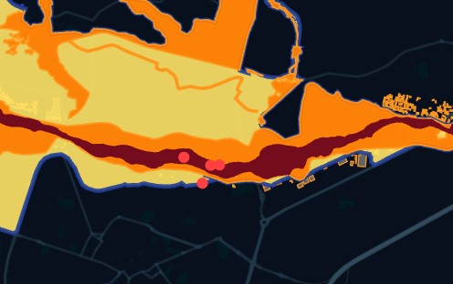
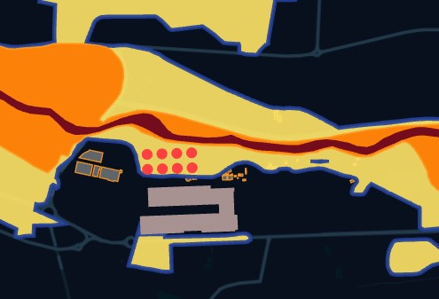
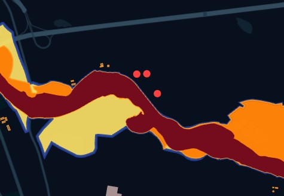

# Po Riverbank Ground Deformation Monitoring — Turin

**An early-warning triage tool for urban infrastructure monitoring, using free Copernicus Sentinel-1 InSAR data.**

![Overview: deformation hotspots along the Po corridor] 

## Overview

This project uses ground deformation data from the European Ground Motion Service (EGMS) — derived from Sentinel-1 InSAR processing — to identify statistically significant zones of ground movement along the Po riverbank corridor in Turin, Italy. These deformation hotspots are then cross-referenced against OpenStreetMap infrastructure data and Italy's official hydrogeological hazard maps (ISPRA PAI) to flag buildings and structures that may be exposed to active, ongoing ground instability that isn't necessarily captured by static, periodically-updated hazard classifications.

The corridor covers Borgo Po, Murazzi, Gran Madre, Corso Moncalieri, and down toward the Moncalieri municipal boundary, plus the Basse di Stura area to the north.

## Motivation

The Po riverbank is one of the most visually striking and expensive residential corridors in Turin, and it's also an area where surface signs of soil fragility (exposed tree roots, visible bank erosion) are common. Official Italian hazard maps (ISPRA's PAI framework) classify flood and landslide risk at a broad, static level. This project asks: **does continuous, satellite-derived deformation data agree with those official classifications, or does it reveal risk that the static maps miss?**

## Repository Structure

```
├── README.md
├── spatial_triage.py           # Clip raw EGMS data to river corridor buffer
├── hotspot_analysis.py         # Getis-Ord Gi* statistical hotspot detection
├── extract_infrastructure.py   # OSM building/infrastructure query + spatial join
├── check_distances.py          # Distance-to-nearest-structure for each hotspot
├── process_ispra.py            # Auto-clip and validate against ISPRA PAI hazard maps
├── fix_kepler_export.py        # Reproject + clean layers for Kepler.gl
├── export_to_kepler.py         # GeoJSON export helper
└── /figures                    # Kepler.gl screenshots, annotated risk zone maps
```

## Data Sources

| Source | What it provides | Access |
|---|---|---|
| **EGMS (European Ground Motion Service)** | Sentinel-1 InSAR-derived vertical & east-west ground velocity, 2019–2023 and 2020–2024 releases, Ortho (Level 3) product | Free, via EGMS Explorer (EU Login required) |
| **OpenStreetMap (via OSMnx)** | Building footprints, bridges, retaining walls, embankments | Free, no auth |
| **ISPRA PAI (Piano di Assetto Idrogeologico)** | Italy's official flood/landslide hydrogeological hazard zones | Free, public shapefiles |

## Methodology

**1. Data acquisition**
Deformation velocity data pulled from EGMS Explorer for the Po corridor bounding box (`7.675,45.035,7.700,45.075`), Ortho product, both available releases.

**2. Spatial triage** (`spatial_triage.py`)
Raw EGMS CSV filtered to a 250m buffer around the Po river geometry (fetched via OSMnx), reprojected to EPSG:3035 for accurate metric buffering, then clipped precisely to the river corridor.

**3. Hotspot detection** (`hotspot_analysis.py`)
Getis-Ord Gi* local spatial statistic (via PySAL/esda) computed on a K=8 nearest-neighbor spatial weights matrix, identifying statistically significant clusters of subsidence and uplift at 95% confidence (p < 0.05, |Z| > 1.96).

**4. Infrastructure exposure** (`extract_infrastructure.py`, `check_distances.py`)
Building footprints, bridges, and retaining structures queried from OSM within the same corridor, spatially joined against the significant hotspot points (10m tolerance buffer) to flag directly-exposed structures, and distance-to-nearest-structure computed for every hotspot as a proximity metric.

**5. Official hazard validation** (`process_ispra.py`)
Hotspot bounding box used to auto-locate and clip the relevant ISPRA PAI shapefiles, converting matched hazard zones to GeoJSON for direct visual comparison against the InSAR-derived hotspots.

**6. Visualization** (`fix_kepler_export.py`, `export_to_kepler.py`)
All layers reprojected to EPSG:4326 and cleaned (geometry validation, type isolation for buildings vs. lines) for direct import into Kepler.gl.

## Key Findings

### 1. Hazard isn't only where the water is


Several significant deformation hotspots occurred outside the immediate blue/water-adjacent zone, including in areas ISPRA maps as moderate risk that are visually green (vegetated) rather than water-adjacent. This is consistent with known subsidence mechanisms unrelated to flooding: organic soil decomposition, fill material consolidation, and clay shrink-swell cycles can all produce measurable ground movement independent of proximity to open water. The takeaway: proximity to the river is a reasonable first-pass filter, but it isn't the only variable that matters, and a purely flood-hazard-based hazard map can miss soil-driven instability nearby.

### 2. A cluster sits inside a former landfill


Two to three hotspot points fall inside or immediately adjacent to the **Ex Discarica Amiat, Basse di Stura** (a decommissioned landfill north of Turin). This is a plausible and well-documented phenomenon: landfill sites are known to continue settling for years to decades after closure, as buried organic waste decomposes and loses volume. This is a distinct deformation mechanism from riverbank erosion, and worth flagging separately in any risk classification — the underlying cause (and the appropriate monitoring response) is different.

### 3. A likely gap in the official hazard layer





A subset of hotspot points fell entirely outside any ISPRA PAI-classified hazard zone in the corresponding shapefile. Two explanations are possible: either these points genuinely sit outside any recognized hazard area (in which case the InSAR data may be surfacing early-stage or previously unclassified instability), or there's a data alignment issue (CRS mismatch, an outdated PAI vintage, or a boundary/tile edge effect from the clipping step). This is flagged as an open question rather than a confirmed conclusion — it needs a manual visual audit against the source ISPRA shapefile before being treated as a genuine finding, but it's exactly the kind of discrepancy this project was designed to surface.

### 4. Specific infrastructure sitting inside high-risk overlap zones


Visual review of named locations identified structures directly inside zones flagged as high-risk (dark red/orange in the classification) by both the InSAR hotspot layer and background hazard shading, including a residential building along **Corso Appio Claudio** and structures in the **Basse di Mirafiori** area, the latter falling within a medium-to-high classified band alongside a dense residential zone.

## Tech Stack

Python 3.11 · GeoPandas · OSMnx · PySAL / esda (Getis-Ord Gi*) · GDAL · Kepler.gl · EGMStoolkit (EGMS data access) · Folium (fallback visualization)

## Limitations & Next Steps

- The apparent gap between InSAR hotspots and ISPRA hazard zones (Finding 3) requires manual verification before being presented as a confirmed methodological insight rather than a possible data artifact.
- The 250m river buffer is a reasonable first-pass corridor definition but somewhat arbitrary; a follow-up could test sensitivity to buffer width.
- This is a triage/screening tool, not a substitute for ground-truthed geotechnical survey — its value is in flagging candidate areas for further investigation, not issuing definitive safety verdicts.
- Ground stability findings here are one input worth considering alongside other factors (structural condition, insurance, official permits) in property-related decisions — not a standalone valuation or safety certification.

## Author

Feria Sabeghi — Geospatial/GIS Analyst, MSc Geography & Territorial Science (University of Turin & Politecnico di Torino)
[GitHub](https://github.com/fereshtehsabeghi) · [LinkedIn](https://linkedin.com/in/fereshtehsabeghi)
